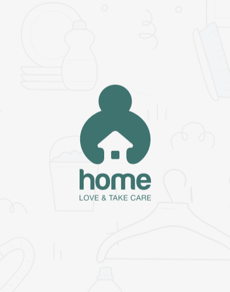

### Home Maintenance Services System Provider API

Building Using Django With Django Rest Framework that integration with Mobile Application

we building API for Application for allow to the user to see all services can provide from system to help to make maintenance home is easy and quickly.

The Services are divided under categories in the system, such as services under the category of electricity, plumbing, or maintenance of electrical appliances.

It also allows the user to follow up on the status of the submitted request, smooth communication in case of any problem, and enables him to evaluate the service after completing its implementation for him.

Also, users can add more than one address (for home) in the event that there is more than one place in which maintenance service is needed, and when requesting a specific service, he chooses the address where he needs this service.

For the payment service it is upon completion of the service (i.e. payment upon receipt) and expected to the upcoming versions of the system connect the system to online payment systems.

The system is linked to the email services provided by Google for use in verification and authentication cases as well.

Language and Tools or frameworks we used:
Database: Postgresql Database
Language: Python
Framework: Django
Another tools: (Github, Gmail)
